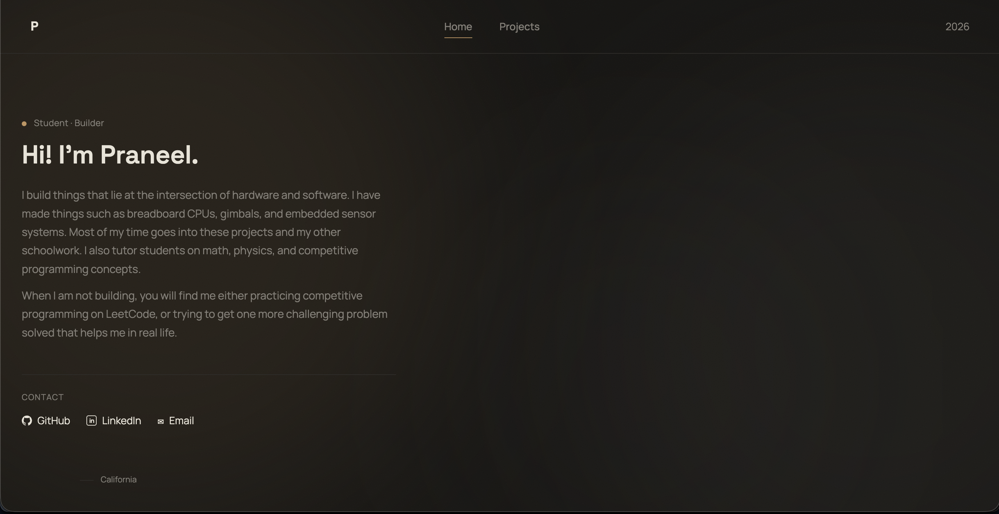
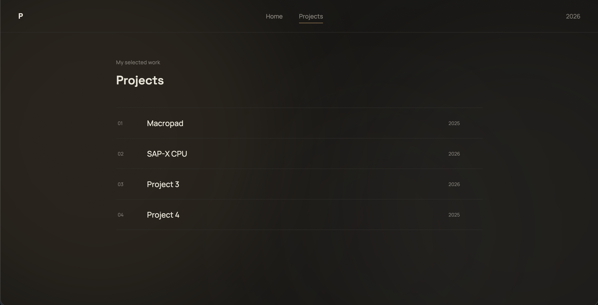

# Builder Page

A personal portfolio website where I can showcase my projects, write about what I build, and share my contact links.

## Description

Builder Page is a simple portfolio website I made to have one place for my projects and information. It has a home page, a projects page with interactive project details, project images, tags, and code sections that load from separate text files. I built the site from scratch using HTML, CSS, and JavaScript and added things like page transitions, a loading screen, responsive design, and a subtle animated background.

### Screenshots

## Getting Started

### Dependencies

* A modern web browser
* Internet connection for loading Google Fonts

### Installing

* Clone or download this repository.
* Keep the folder structure the same so the images and code files can load correctly.

### Executing program

* Open the project in VS Code.
* Open the local website in your browser using a local server such as Live Server.

## Help

If images or code sections are not loading, make sure the file paths in `script.js` match the folders and filenames in the project.

## License

This project is licensed under the MIT License - see the LICENSE.md file for details.
